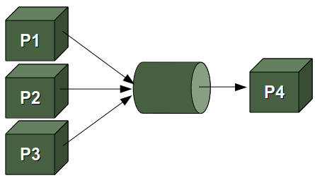

### Introduction
A named pipe is a one-way or duplex pipe that provides communication between the pipe server and some pipe clients. A pipe is a section of memory that is used for interprocess communication. A named pipe can be described as first in, first out (FIFO); the inputs that enter first will be output first.

A named pipe differs from an anonymous pipe in that it can exist beyond the life of its associated processes and must be explicitly deleted.



### Getting started
In one terminal run:
```bash
python src/collector.py
```

In another terminal run:
```bash
python src/example.py
```

or just:
```sh
docker-compose up
```
